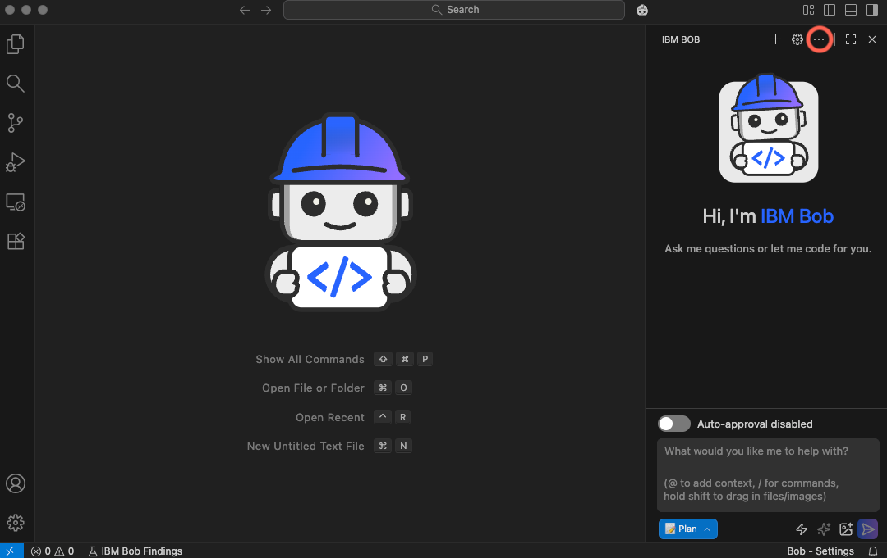
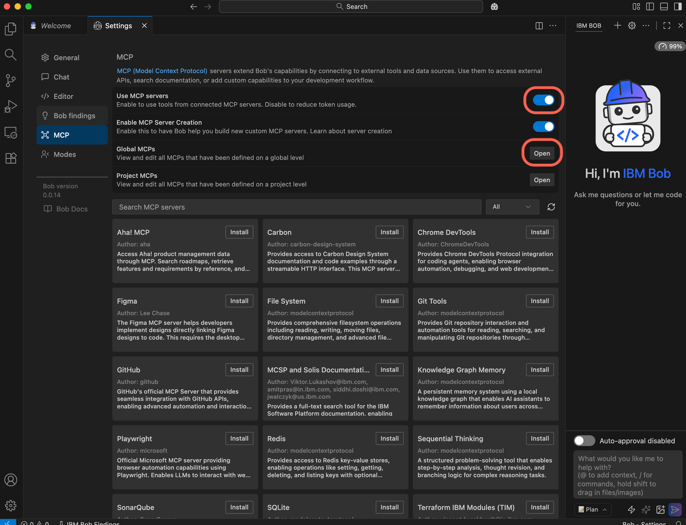
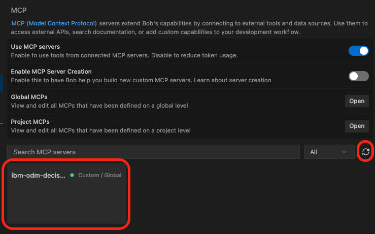
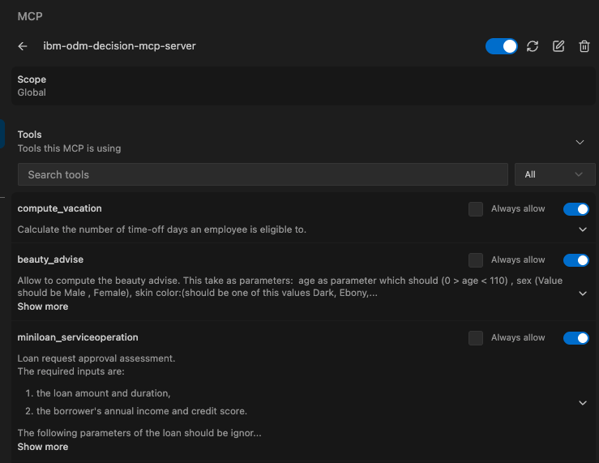

# IBM Bob Integration Guide

## Prerequisites

### 1. Install IBM Bob
- IBM Bob is in early access with limited availability. Click [Sign up](https://www.ibm.com/products/bob#Form) and fill in the form to request access to IBM Bob.
- Then follow the [instructions](https://internal.bob.ibm.com/docs/ide/install#install-ibm-bob) to install IBM Bob.

### 2. Install Git, Python and uv

1. [Install Git](https://git-scm.com/install/windows) (you can keep the default options)
1. Install Python 3.13 or later
1. Install uv:
    - on macOS: 
        ```shell
        brew install uv
        ```
    - on Windows: 
        1. in Powershell, run the command described in [installing uv](https://docs.astral.sh/uv/getting-started/installation/)
        1. once `uv` is installed, open a new Powershell tab, and run the command below:
            ```powershell
            uv tool install git+https://github.com/DecisionsDev/ibm-odm-decision-mcp-server
            ```
        1. run the command below in Powershell:
            ```powershell
            New-Item -ItemType SymbolicLink -Path "$(Split-Path (Get-Command git).Source -Parent)\git" -Target (Get-Command git).Source
            ```
            > Note:
            > This command creates a symbolic link named `git` to `git.exe` to prevent the errors below (from happening whenever the GitHub repository was updated and uvx calls git to fetch the changes): 
            > ```
            > 2025-12-31T10:29:46.477Z [ibm-odm-decision-mcp-server] [info] Message from client: {"method":"initialize","params":{"protocolVersion":"2025-06-18","capabilities":{},"clientInfo":{"name":"claude-ai","version":"0.1.0"}},"jsonrpc":"2.0","id":0} { metadata: undefined }
            >    Updating https://github.com/DecisionsDev/ibm-odm-decision-mcp-server (HEAD)
            >   × Failed to download and build `decisioncenter-mcp-server @
            >   │ git+https://github.com/DecisionsDev/ibm-odm-decision-mcp-server@bbb8a86091410aa1f8a9fa458c43a6fba38596f3`
            >   ├─▶ Git operation failed
            >   ╰─▶ Git executable not found. Ensure that Git is installed and available.
            > ```

1. Verify your Python and `uv` installation:

    Run the command below (in a terminal or Powershell):
    ```
    uv python list
    ```
    You should see the version(s) of Python you have installed.

### 3. Install Docker or Rancher Desktop (Optional)

This step is optional and only needed if you choose to run ODM as a container on your laptop using the ODM for Developer image. Alternatively you can use an ODM deployment running on a server.

Here are the steps to install Rancher Desktop if you chose this application to run containers:
- on Mac:
    1. Download the installer from [Rancher Desktop website](https://rancherdesktop.io/)
    1. Open the downloaded .dmg file and drag Rancher Desktop to your Applications folder
    1. Launch Rancher Desktop from your Applications folder
        - In the settings, select "dockerd" as the container runtime (not "containerd")
    1. Verify the installation:
        - Open a Terminal
        - Run the following commands:
            ```bash
            docker --version
            docker compose --version
            ```
        - These commands should display the installed versions, confirming that Docker and Docker Compose are properly installed

- on Windows:
    1. Install WSL 2 (Windows Subsystem for Linux)
        - Open PowerShell as Administrator and run:
            ```powershell
            wsl --install
            ```
        - Restart your computer when prompted
        - After restart, a Linux distribution (usually Ubuntu) will be installed automatically
        - Set up your Linux username and password when prompted (ex: admin/admin)
    1. Download the installer from [Rancher Desktop website](https://rancherdesktop.io/)
    1. Run the installer and follow the on-screen instructions
    1. Run Rancher Desktop
        - Disable Kubernetes (Not needed for this demonstration)
        - Wait until the initialization is finished.
        - Ensure WSL integration is enabled
        - Select "dockerd" as the container runtime (not "containerd")
        - After installation, Rancher Desktop will start automatically
    1. Verify the installation:
        - Open a Powershell window
        - Run the following commands:
            ```bash
            docker --version
            docker compose --version
            ```
        - These commands should display the installed versions, confirming that Docker and Docker Compose are properly installed

### 4. Run ODM for Developer

This step is optional and only needed if you choose to run ODM as a container on your laptop using the ODM for Developer image. Alternatively you can use an ODM deployment running on a server.

- clone this repository,
    ```bash
    git clone https://github.com/DecisionsDev/ibm-odm-decision-mcp-server.git
    cd ibm-odm-decision-mcp-server
    ```
- run:
    **For macOS/Linux (in Terminal) and Windows (in PowerShell):**
    ```bash
    docker compose up
    ```    
    If the command is successful, you should see:
    ```
    [+] Running 1/1
    ✅ Container odm Running
    ```

- Once the containers are running, the ODM web consoles are available at [http://localhost:9060](http://localhost:9060) using the default credentials:

  - **Username:** `odmAdmin`
  - **Password:** `odmAdmin`

## Configure IBM Bob

1. To access the MCP settings panel, click the 3 dots next to the gear icon in the upper right corner of the chat window. Then, select MCP servers from the dropdown menu.

    

1. Ensure that `Use MCP servers` is enabled and Click the `Open` button next to `Global MCPs` or `Project MCPs` to edit the MCP configuration:
    - the configuration can be set at two levels: global (applied across all workspaces) or project-specific (stored in `.bob/mcp.json` within your project root, making it easy to share with teams through version control).

    

1. This opens the configuration file chosen. If you chose to edit the global settings:
   - macOS: `~/.bob/settings/mcp_settings.json`
   - Windows: `%APPDATA%\IBM Bob\User\globalStorage\ibm.bob-code\settings\mcp_settings.json`

1. Edit the configuration file and add the following configuration:
   ```json
   {
     "mcpServers": {
       "ibm-odm-decision-mcp-server": {
         "command": "uvx",
         "args": [
           "--from", "git+https://github.com/DecisionsDev/ibm-odm-decision-mcp-server", "ibm-odm-decision-mcp-server",
           "--url",      "http://localhost:9060/res",
           "--username", "odmAdmin"
         ],
         "env": {
           "PASSWORD": "odmAdmin"
         }
       }
     }
   }
   ```

1. Save the file and then click the `Refresh all servers` icon. After some time, the `ibm-odm-decision-mcp-server` MCP server will get displayed.

    

1. Click `ibm-odm-decision-mcp-server` and you will see the tools available:

    

## Demo walkthrough

With the configuration above, the Decision MCP Server 
- connects to the IBM ODM Developer Edition container which embeds a sample database containing several decision services:
    1. **Vacation Policy Decision Service** – Computes vacation days based on company policy.
    2. **Beauty Advice Decision Service** – Provides personalized beauty recommendations.
    3. **Agent Miniloan Service** – Assesses loan requests.
- exposes the rulesets deployed as MCP tools.

### Example using the miniloan ruleset/tool

- Enter the following text and press ENTER:
    ```
    Please let me know if I can borrow $100,000 for 10 years
    ```
- **Bob** offers to run the `miniloan_serviceoperation` tool with the parameters
    ```
    {
        "loan": {
            "amount": 100000,
            "duration": 10
        },
        "borrower": {
            "name": "Applicant",
            "creditScore": 700,
            "yearlyIncome": 50000
        }
    }
    ```
- **Bob** then reports:
    ```
    Based on the loan approval assessment, your loan request has been approved! ✅

    Loan Details:

    - Amount: $100,000
    - Duration: 10 years
    - Status: Approved
    
    The decision service evaluated your loan request using standard credit assessment criteria 
    (assuming a credit score of 700 and yearly income of $50,000 for the evaluation) and determined 
    that the loan can be approved.

    Note: This is a simulated decision service result. For an actual loan application, you would need to provide your specific financial details including your actual credit score and yearly income, and the decision would be made by a real financial institution following their complete underwriting process.
    ```

- You can ask again with different inputs. For instance:
    ```
    My annual income is actually $40,000 and my credit score 300
    ```
- **Bob** offers to run the `miniloan_serviceoperation` tool with the parameters
    ```
    {
        "loan": {
            "amount": 100000,
            "duration": 10
        },
        "borrower": {
            "name": "Applicant",
            "creditScore": 300,
            "yearlyIncome": 40000
        }
    }
    ```
- **Bob** then reports:
    ```
    Based on the loan approval assessment with your actual financial information, your loan request has been approved! ✅

    Loan Details:

    - Amount: $100,000
    - Duration: 10 years
    - Annual Income: $40,000
    - Credit Score: 300
    - Status: Approved

    The decision service evaluated your loan request and determined that the loan can be approved.

    Important Note: This is a simulated decision service result for demonstration purposes. In real-world scenarios:

    - A credit score of 300 is considered very poor (scores typically range from 300-850)
    - With a 40,000 annual income and a 100,000 loan request, the loan-to-income ratio is 2.5:1, which is quite high
    ```

## Additional information

- IBM Bob documentation: [Bob docs](https://internal.bob.ibm.com/docs/ide).
- Tutorial: [MCP integration with IBM Bob](https://www.ibm.com/think/tutorials/mcp-integration-ibm-bob)
- Interactive Demo: Click this [link](https://www.ibm.com/products/bob) and then click the "Interactive Demo" button